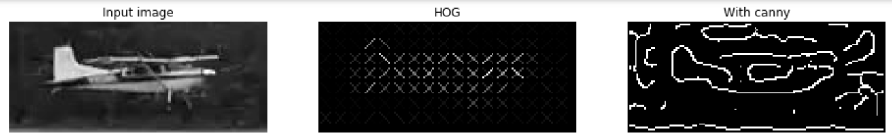

# machine-learning

## Assignment 2: Airplane Image Classification

This assignment entails detecting airplanes images. The assighment details can be found [here](https://docs.google.com/document/d/1qLq0yrg_AW9JYEgMENHI6FCKFvHW27CvlIjU_rb2a3o/edit).

### Draft 1

The initial model was explored by adding features and setting feature paramenters ([see](images_starter_2.ipynb)). 

The `canny` feature detection was found to work best with `sigma=3`, however it did not perform that well with images that contained droplets on the lens/window.
The `hog` feature was found to work well, but was limited due to image resolution. Subsequently maximum image resolution was used and pixel cell parameters tuned.

`
fd, hog_image = hog(downscaled, orientations=2, pixels_per_cell=(8, 8),
                    cells_per_block=(2, 2), visualize=True, multichannel=False)
`

The neural network performed slightly better than perceptron and with `alpha=0.0004` the test data performance was almost the same as the training data performance. 
The [model is here](planeimages_first_full_iteration.ipynb)

### Final version

The final version of the assignment included updates to the neural network layers.
Previously only one layer with 100 rows was used, but was updated to two layers
with 50 rows each. More experimentation with the amount of layers could likely be conducted.