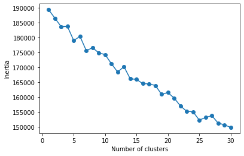
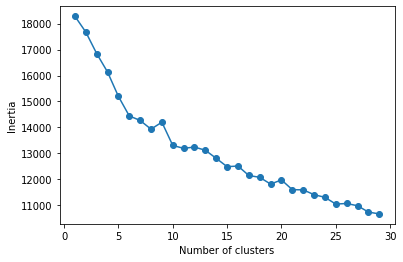
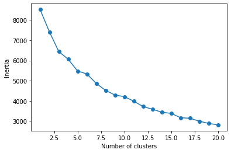
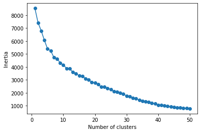
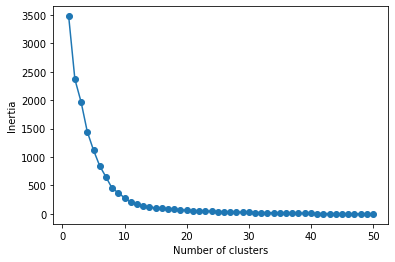
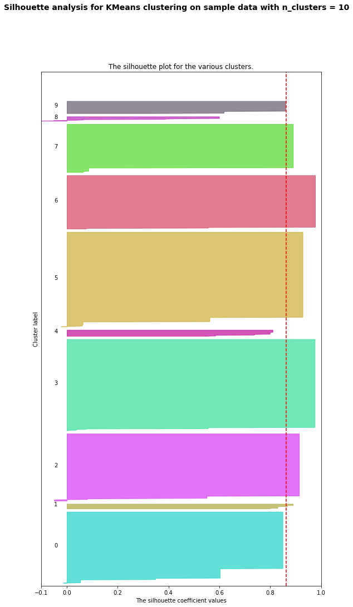

# machine-learning

## Assignment 3 Option 1: Amazon Fine Food Reviews

This assignment entails clustering Amazon review data. 
The Jupyter notebook is found [here](kmeans_amazon.ipynb).

### Draft 1

When starting out it soon became apparent that the data has a "long tail" in the number of reviews,
i.e. many records have only a few number of reviews, which make it more difficult to cluster properly.
By doing an eigenvalue/inertia plot it was found that filtering data by the number of reviews had
a significant effect on the amount of clusters that could be identified.

Including only data with more than 4 reviews:

Including only data with more than 50 reviews:

The elbow plot seemed mostly invariant of the chosen number of clusters.
With processing limits much more than 50 clusters would need to be used
to get a meaningful model.

Including only data with more than 100 reviews up to 20 clusters:

Including only data with more than 100 reviews up to 50 clusters:

Including only data with more than 150 reviews seems promising, 
because a clear elbow can be identified at 10 clusters.

Including only data with more than 150 reviews yields an acceptable silhouette plot.
When fewer clusters are selected (not shown) there are clusters that are very wide
and very flat.

It is recommended to also investigate further transformations on the text.

